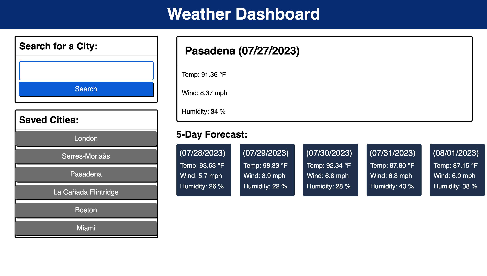

<h1>Weather Tracker</h1>	
<h2>Developed by David Montoto</h2>	

Welcome to Weather Tracker, a website dedicated to presenting important weather information for the next five days for any desired city. This website presents the user with an easy and straightforward way to check weather forecasts all around the world. Through local storage allocation, the Weather Tracker website will retain all saved cities by the user. When the user searches more than 20 unique cities, the website will reset the save bar to allow for more searching. 

[Weather Tracker](https://dmmontoto.github.io/Weather-Tracker/ "Weather Planner")

In order to practice efficiency and compartmentalization, I planned my functions through sudo code prior to development. In total, I had 5 functions developed and two event listeners to allow for user ease and all possible edge cases. My main function call has two fetches that get the longitude and latitude of a city, before using those coordinates to fetch a five-day weather forecast. This function is also in charge of keeping a tally on how many different cities have been searched, along with storing all info in local storage to be used later at the user's discretion. My other function which switches the weather on the main display by clocking on any city in the saved bar utilizes local storage to access the saved data from the other function. Other functions such as my clear all function and reload function ensure the user's page never overflows with saved city data but also ensures that already-saved cities are always displayed on the side upon refreshing the page. 

 Please take the time to explore various cities on my website and check out their future forecasts!

